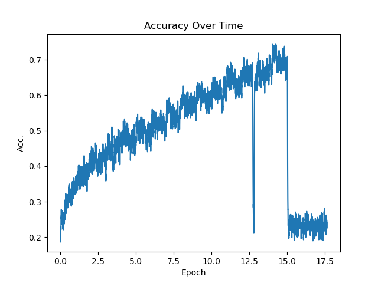
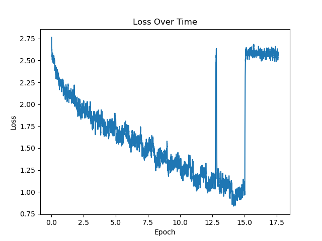
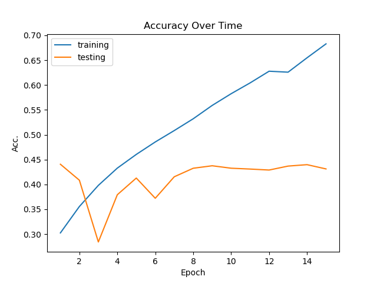
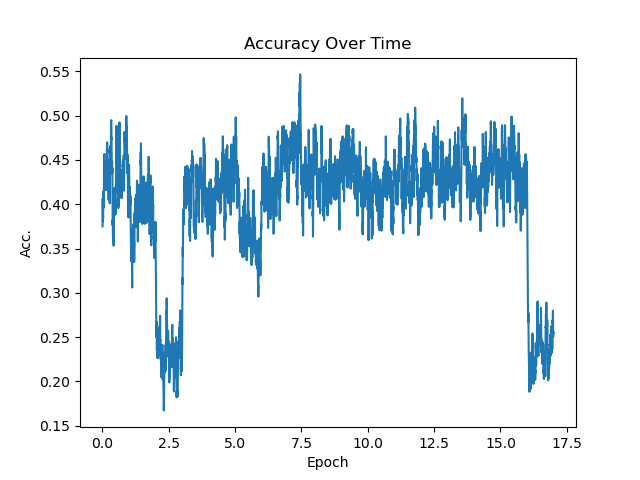
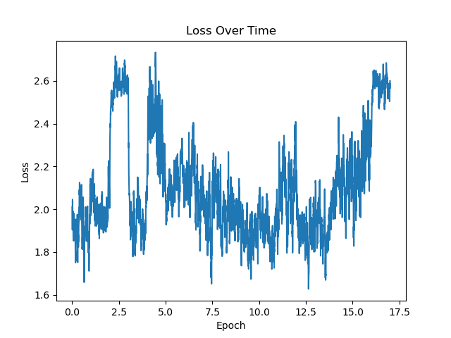
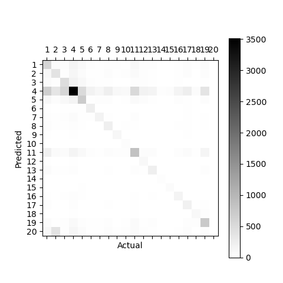

# Newspaper Tension: GDELT Event Analysis with BERT

This project uses the Bidirectional Encoder Representations from Transformers model to classify news in the [GDELT](https://www.gdeltproject.org/) (Global Database of Events, Language, and Tone) dataset by a metric such as the Goldstein Scale or RootCode. 

## Installation

Navigate to the project directory and install the package in editable mode
```bash
cd Newspaper_Tension
pip install -e .
```


## GDELT Data Collection

This project works with the GDELT dataset. You'll need to collect and prepare the data before training your models.

### Quick Data Collection

The project includes a built-in data retrieval system in "retrieve_data.py".

#### Basic Data Download

```python
from Newspaper_Tension.retrieve_data import download_helper

# Download data for specific country pairs
download_helper(
    actor_one="RUSSIA",
    actor_two="UKRAINE", 
    out_dir="/path/to/your/data/RUSSIA_UKRAINE",
    subsample=10  # Download every 10th article to reduce data size
)
```

#### Batch Data Collection

For multiple country pairs, you can use the provided script:

```python
from Newspaper_Tension.retrieve_data import download_helper

# Define country pairs of interest
pairs = [
    ("RUSSIA", "UKRAINE"),
    ("UNITED STATES", "RUSSIA"),
    ("ISRAEL", "PALESTINE"),
    ("UNITED STATES", "AFGHANISTAN"),
    ("UNITED STATES", "CHINA"),
    ("CHINA", "TAIWAN"),
    ("SAUDI ARABIA", "IRAN"),
]

# Download data for each pair
for actor_one, actor_two in pairs:
    print(f"Downloading data for {actor_one} -> {actor_two}")
    download_helper(
        actor_one, actor_two,
        out_dir=f"/path/to/your/data/{actor_one}_{actor_two}".replace(" ", "-"),
        subsample=10
    )
```

This script also runs directly from "retrieve_data.py"

```bash
# Modify the paths in retrieve_data.py and run:
python retrieve_data.py
```

### Advanced Data Collection

#### Using the Gdelt_Downloader Class

For more control over the data collection process, you can directly filter files from the Gdelt_Downloader class.

```python
from Newspaper_Tension.retrieve_data import Gdelt_Downloader

# Initialize downloader
gdelt = Gdelt_Downloader(
    output_dir="/your/data/directory",
    work_dir="/tmp/gdelt_work"
)

gdelt.download_compressed(num_workers=8)
gdelt.extract_compressed(num_workers=8)
gdelt.filter_tsvs(
    match_style="match", 
    filters={
        "Actor1Name": "RUSSIA", 
        "Actor2Name": "UKRAINE",
        "IsRootEvent": "1"  # Only root events
    }
)
gdelt.filter_tsvs(
    match_style=">", 
    method="or", 
    filters={"AvgTone": 20.0}
)

gdelt.download_articles(subsample=10, num_workers=8)
```

### Data Directory Structure

After collection, your data will be organized as:

```
your_data_directory/
├── RUSSIA_UKRAINE/
│   ├── tsv_files/           # Filtered GDELT metadata
│   ├── articles/            # Full news articles
│   │   ├── 123456789.txt   # Article text files (by event ID)
│   │   └── ...
│   └── summaries/           # Article summaries
│       ├── 123456789.txt   # Summary text files (by event ID)
│       └── ...
├── UNITED-STATES_RUSSIA/
└── ...
```

### Configuration Options

Update paths in "constants.py":

```python
# In constants.py
DEFAULT_DOWNLOAD_DIR = '/your/preferred/data/directory'
DEFAULT_GDELT_BASE_URL = 'http://data.gdeltproject.org/events'
```

Common filtering patterns:

```python
# Filter by specific actors
filters = {
    "Actor1Name": "UNITED STATES",
    "Actor2Name": "CHINA",
    "IsRootEvent": "1"
}

# Filter by event types (see GDELT CAMEO codes)
filters = {"EventRootCode": "14"}  # Protest events

# Filter by time period (YYYYMMDD format)
filters = {"SQLDATE": "20230101"}  # Events from Jan 1, 2023

# Filter by geographic region
filters = {
    "Actor1CountryCode": "USA",
    "Actor2CountryCode": "CHN"
}
```

## Usage

Once installed as a package, the codebase can be called anywhere 

```python
from Newspaper_Tension import GDELT_BERT, BERT
import transformers

# Initialize tokenizer and dataset
tokenizer = transformers.BertTokenizer.from_pretrained("bert-base-uncased")
dataset = GDELT_BERT(
    tokenizer=tokenizer, 
    root_dir="/path/to/your/data/"
    selected_factor="EventRootCode",
    split="train"
)

model = BERT()

train_loader = torch.utils.data.DataLoader(dataset, batch_size=32, shuffle=True)
```

### Training

#### Basic Training

```bash
python train_bert.py
```

#### Custom Training

```python
from Newspaper_Tension.dataset_bert import GDELT_BERT
from Newspaper_Tension.model_bert import BERT
import transformers
import torch

# Setup
tokenizer = transformers.BertTokenizer.from_pretrained("bert-base-uncased")
train_dataset = GDELT_BERT(
    tokenizer=tokenizer,
    root_dir="/path/to/your/data",
    selected_factor="EventRootCode",
    split="train"
)

# Training configuration
model = BERT().cuda()
optimizer = torch.optim.SGD(model.parameters(), lr=0.01)
criterion = torch.nn.CrossEntropyLoss()

# Training loop
for epoch in range(50):
    # Your training code here
    pass
```

### Testing

After training your model, use "test_bert.py" to evaluate performance on the test set. The model can also be evaluated based on its top-k choices containing the correct value.

```bash
# Test with top-1 accuracy
python test_bert.py 1

# Test with top-5 accuracy
python test_bert.py 5
```

## Visualization and Analysis

The project includes several plotting utilities to analyze training results and model performance.

### Plotting Training Metrics

Use "plot.py" to generate accuracy and loss plots from training logs:

```bash
# Plot training accuracy over time
python plot.py /path/to/run/directory --plot-acc

# Plot training loss over time
python plot.py /path/to/run/directory --plot-loss

# Apply exponential smoothing (alpha = 0.9)
python plot.py /path/to/run/directory --plot-acc -a 0.9
```

This generates:
- "_acc.png": Training accuracy over epochs



- "_loss.png": Training loss over epochs



### Comparing Training vs Testing Performance

Use "plotboth.py" to compare training and testing metrics side by side:

```bash
# Compare training and testing accuracy
python plotboth.py /path/to/training/run /path/to/testing/run

# With smoothing
python plotboth.py /path/to/training/run /path/to/testing/run -a 0.8
```

This generates "both_acc.png" for a training vs testing accuracy comparison



### Advanced Analysis with plottest.py

The "plottest.py" script includes confusion matrices and top choice functionalities in addition to those provided in training:

```bash
# Generate accuracy plots
python plottest.py /path/to/run/directory --plot-acc

# Generate loss plots
python plottest.py /path/to/run/directory --plot-loss

# Generate confusion matrices (specify top-k predictions)
python plottest.py /path/to/run/directory --confusion-matrix --top 1

# Generate top-2 and top-5 confusion matrices
python plottest.py /path/to/run/directory --confusion-matrix --top 2
python plottest.py /path/to/run/directory --confusion-matrix --top 5

# Apply smoothing to all plots
python plottest.py /path/to/run/directory --plot-acc --plot-loss -a 0.85
```

This generates:
- "test_acc.png`: Testing accuracy over time



- "test_loss.png`: Testing loss over time  



- "test_confusion_matrix{epoch}.png": Top-k confusion matrices for each epoch


